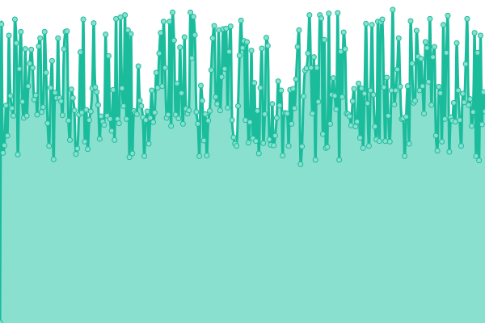
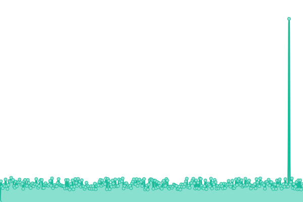
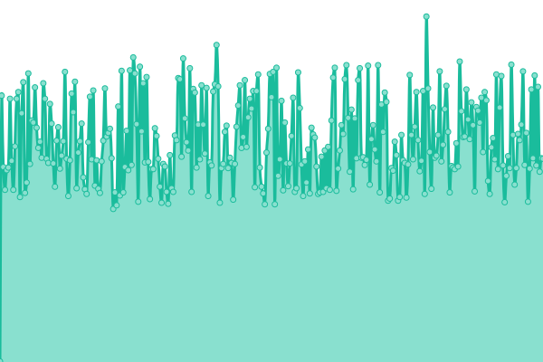
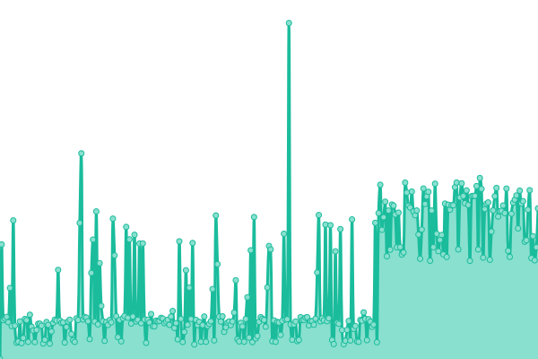
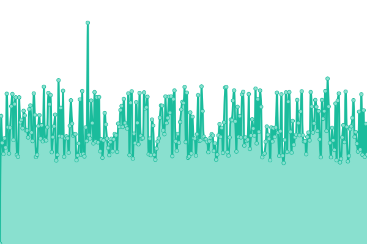
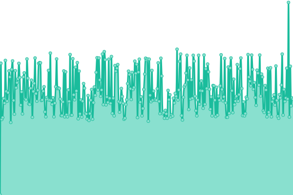
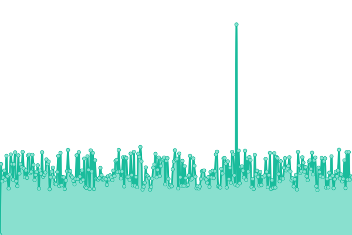
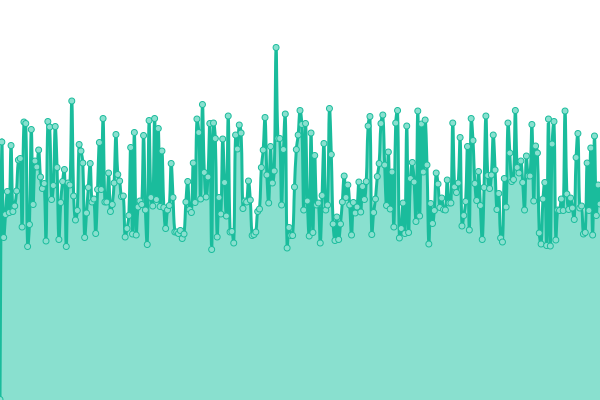

# [📈 Live Status](https://SRESchool.github.io/AllJetexe-monitor-upptime): <!--live status--> **🟧 Partial outage**

This repository contains the open-source uptime monitor and status page for [SRESchool](https://SRESchool.github.io/AllJetexe-monitor-upptime), powered by [Upptime](https://github.com/upptime/upptime).

With [Upptime](https://upptime.js.org), you can get your own unlimited and free uptime monitor and status page, powered entirely by a GitHub repository. We use [Issues](https://github.com/SRESchool/AllJetexe-monitor-upptime/issues) as incident reports, [Actions](https://github.com/SRESchool/AllJetexe-monitor-upptime/actions) as uptime monitors, and [Pages](https://SRESchool.github.io/AllJetexe-monitor-upptime) for the status page.

<!--start: status pages-->
<!-- This summary is generated by Upptime (https://github.com/upptime/upptime) -->
<!-- Do not edit this manually, your changes will be overwritten -->
<!-- prettier-ignore -->
| URL | Status | History | Response Time | Uptime |
| --- | ------ | ------- | ------------- | ------ |
|  [AIAviationAcademy](https://aiaviationacademy.com) | 🟩 Up | [ai-aviation-academy.yml](https://github.com/SRESchool/AllJetexe-monitor-upptime/commits/HEAD/history/ai-aviation-academy.yml) | 

 3855ms
     
 | 

<a href="https://SRESchool.github.io/AllJetexe-monitor-upptime/history/ai-aviation-academy">97.56%</a>
    

|  [AircraftO](https://aircrafto.com) | 🟩 Up | [aircraft-o.yml](https://github.com/SRESchool/AllJetexe-monitor-upptime/commits/HEAD/history/aircraft-o.yml) | 

 429ms
     
 | 

<a href="https://SRESchool.github.io/AllJetexe-monitor-upptime/history/aircraft-o">100.00%</a>
    

|  [CharterKings](https://charterkings.com) | 🟩 Up | [charter-kings.yml](https://github.com/SRESchool/AllJetexe-monitor-upptime/commits/HEAD/history/charter-kings.yml) | 

 426ms
     
 | 

<a href="https://SRESchool.github.io/AllJetexe-monitor-upptime/history/charter-kings">100.00%</a>
    

|  [ExecutiveAirRepair](https://executiveairrepair.com) | 🟩 Up | [executive-air-repair.yml](https://github.com/SRESchool/AllJetexe-monitor-upptime/commits/HEAD/history/executive-air-repair.yml) | 

 434ms
     
 | 

<a href="https://SRESchool.github.io/AllJetexe-monitor-upptime/history/executive-air-repair">100.00%</a>
    

|  [FlightTrainingUS](https://flighttrainingus.com) | 🟩 Up | [flight-training-us.yml](https://github.com/SRESchool/AllJetexe-monitor-upptime/commits/HEAD/history/flight-training-us.yml) | 

 444ms
     
 | 

<a href="https://SRESchool.github.io/AllJetexe-monitor-upptime/history/flight-training-us">100.00%</a>
    

|  [FlyAIAA](https://flyaiaa.com) | 🟩 Up | [fly-aiaa.yml](https://github.com/SRESchool/AllJetexe-monitor-upptime/commits/HEAD/history/fly-aiaa.yml) | 

 428ms
     
 | 

<a href="https://SRESchool.github.io/AllJetexe-monitor-upptime/history/fly-aiaa">100.00%</a>
    

|  [JetAndRotor](https://jetandrotor.com) | 🟥 Down | [jet-and-rotor.yml](https://github.com/SRESchool/AllJetexe-monitor-upptime/commits/HEAD/history/jet-and-rotor.yml) | 

 0ms
     
 | 

<a href="https://SRESchool.github.io/AllJetexe-monitor-upptime/history/jet-and-rotor">0.03%</a>
    

|  [JetExe](https://jetexe.com) | 🟩 Up | [jet-exe.yml](https://github.com/SRESchool/AllJetexe-monitor-upptime/commits/HEAD/history/jet-exe.yml) | 

 1899ms
     
 | 

<a href="https://SRESchool.github.io/AllJetexe-monitor-upptime/history/jet-exe">97.56%</a>
    

|  [KitPlanePart](https://kitplanepart.com) | 🟩 Up | [kit-plane-part.yml](https://github.com/SRESchool/AllJetexe-monitor-upptime/commits/HEAD/history/kit-plane-part.yml) | 

 428ms
     
 | 

<a href="https://SRESchool.github.io/AllJetexe-monitor-upptime/history/kit-plane-part">100.00%</a>
    

|  [LearnFlying](https://learnflying.com) | 🟩 Up | [learn-flying.yml](https://github.com/SRESchool/AllJetexe-monitor-upptime/commits/HEAD/history/learn-flying.yml) | 

 427ms
     
 | 

<a href="https://SRESchool.github.io/AllJetexe-monitor-upptime/history/learn-flying">100.00%</a>
    

|  [LightSportWest](https://lightsportwest.com) | 🟩 Up | [light-sport-west.yml](https://github.com/SRESchool/AllJetexe-monitor-upptime/commits/HEAD/history/light-sport-west.yml) | 

 429ms
     
 | 

<a href="https://SRESchool.github.io/AllJetexe-monitor-upptime/history/light-sport-west">100.00%</a>
    

|  [PilotsDeal](https://pilotsdeal.com) | 🟩 Up | [pilots-deal.yml](https://github.com/SRESchool/AllJetexe-monitor-upptime/commits/HEAD/history/pilots-deal.yml) | 

 431ms
     
 | 

<a href="https://SRESchool.github.io/AllJetexe-monitor-upptime/history/pilots-deal">100.00%</a>
    

|  [PegasusEstates](https://pegasus-estates.com) | 🟩 Up | [pegasus-estates.yml](https://github.com/SRESchool/AllJetexe-monitor-upptime/commits/HEAD/history/pegasus-estates.yml) | 

 435ms
     
 | 

<a href="https://SRESchool.github.io/AllJetexe-monitor-upptime/history/pegasus-estates">100.00%</a>
    

|  [PilotsIndia](https://pilotsindia.com) | 🟩 Up | [pilots-india.yml](https://github.com/SRESchool/AllJetexe-monitor-upptime/commits/HEAD/history/pilots-india.yml) | 

 428ms
     
 | 

<a href="https://SRESchool.github.io/AllJetexe-monitor-upptime/history/pilots-india">100.00%</a>
    

|  [PilotTrainingUS](https://pilottrainingus.com) | 🟩 Up | [pilot-training-us.yml](https://github.com/SRESchool/AllJetexe-monitor-upptime/commits/HEAD/history/pilot-training-us.yml) | 

 431ms
     
 | 

<a href="https://SRESchool.github.io/AllJetexe-monitor-upptime/history/pilot-training-us">100.00%</a>
    

|  [PlanesPart](https://planespart.com) | 🟩 Up | [planes-part.yml](https://github.com/SRESchool/AllJetexe-monitor-upptime/commits/HEAD/history/planes-part.yml) | 

 423ms
     
 | 

<a href="https://SRESchool.github.io/AllJetexe-monitor-upptime/history/planes-part">100.00%</a>
    

|  [ProEzi](https://proezi.com) | 🟩 Up | [pro-ezi.yml](https://github.com/SRESchool/AllJetexe-monitor-upptime/commits/HEAD/history/pro-ezi.yml) | 

 427ms
     
 | 

<a href="https://SRESchool.github.io/AllJetexe-monitor-upptime/history/pro-ezi">100.00%</a>
    

|  [BuyMLocal](https://buymlocal.com) | 🟥 Down | [buy-m-local.yml](https://github.com/SRESchool/AllJetexe-monitor-upptime/commits/HEAD/history/buy-m-local.yml) | 

 0ms
     
 | 

<a href="https://SRESchool.github.io/AllJetexe-monitor-upptime/history/buy-m-local">0.00%</a>
    

<!--end: status pages-->

[**Visit our status website →**](https://SRESchool.github.io/AllJetexe-monitor-upptime)

## 📄 License

- Powered by: [Upptime](https://github.com/upptime/upptime)
- Code: [MIT](./LICENSE) © [Anand Chowdhary](https://anandchowdhary.com), supported by [Pabio](https://pabio.com)
- Data in the `./history` directory: [Open Database License](https://opendatacommons.org/licenses/odbl/1-0/)
